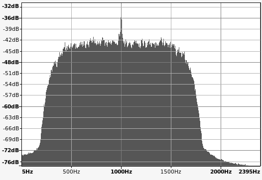

Under Development - Not Fully Functional   
I need to modify the costas loop to generate DCD.   

### A QPSK IP Radio Network Node
Based on highly modified Dire Wolf repository, to create a Linux based QPSK Packet Radio Node. This design uses 1200 baud, giving 2400 bit/s (2-bits per Baud) throughput, in 1.6 kHz of bandwidth. This can also be used on VHF and above if you have an SSB rig. 

It uses an I/Q sampling rate of 9600 bit/s. A Root-Raised-Cosine (RRC) matched filter is used on transmit and receive, and a slightly modified Improved Layer 2 Protocol [(IL2P)](docs/il2p-readme.md) encodes the data onto modified AX.25 protocol packets. A Gardner Timing Error Detection (TED). and a Costas Loop are used on receive.  

These are meant to be point-point links, and digipeaters were designed out. Digipeaters are deprecated in this network design.  

For Internet Protocol (IP) use, it must operate in the automatically controlled band segments. The center frequency of ```1 kHz``` keeps the signal well inside the audio bandpass of most radios.   

IL2P only uses the maximum FEC and Header Type 1. It is used to transport Level 3 Internet Protocol (IP). There is some Broadcast functionality for ARP, Node Identification, and multicast UDP. The KISS is limited to sending data, and control commands are masked off.   

The modem uses the ALSA Linux Soundcard 16-bit 1-channel PCM, at a fixed 9600 bit/s sample rate. The network interface uses a Linux pseudo-terminal running the KISS protocol. This interfaces to the kernel AX.25 using the ```kissattach``` program, making the modem routable over IP.   
### Status
Ubuntu desktop is used for development. The PTT code is currently commented out to prevent core dumps, as the desktop doesn't have the GPIO, but the idea is to run this on a Linux microcontroller (Raspberry Pi) when fully developed.   

The GPIO will need PTT, DCD, Connect, and Sync as interface lines.   



This is 1 kHz +/- 800 Hz or 1600 Hz bandwidth, so the emission symbol would be **1K60J2D**. The little pip in the center is the unscrambled preamble/postample.
### Startup
The ```ipnode``` program runs in a loop with three threads (tx, rx, and kiss). It will read the config file ```ipnode.conf``` if available, and begin running.
```
$ ipnode >>ipnode.log 2>&1 &
```
Using ax25-tools and ```kissattach``` command seems to work well as the pseudo-terminal kiss interface.

Example:

Create the ```/etc/ax25/axports``` file:
```
#
# The format of this file is:
# name callsign speed paclen window description
#
ip172 W1AW-10 0	256 7	ip172 port (1200 Baud QPSK)
```
To use the AX.25 pseudo-terminal:
```
$ sudo kissattach $(ls -l /tmp/kisstnc | awk '{print $NF}') ip172
$ sudo ip addr add 172.30.10.1/24 dev ax0
```
You should see a new interface called ```ax0``` which should look something like this:
```
$ ifconfig ax0
ax0: flags=67<UP,BROADCAST,RUNNING>  mtu 255
        inet 172.30.10.1  netmask 255.255.255.0  broadcast 0.0.0.0
        ax25 W1AW-10  txqueuelen 10  (AMPR AX.25)
        RX packets 0  bytes 0 (0.0 B)
        RX errors 0  dropped 0  overruns 0  frame 0
        TX packets 97  bytes 11112 (11.1 KB)
        TX errors 0  dropped 0 overruns 0  carrier 0  collisions 0
```
A routing table might look like this:
```
$ route -4n
Kernel IP routing table
Destination     Gateway         Genmask         Flags Metric Ref    Use Iface
0.0.0.0         192.168.1.1     0.0.0.0         UG    100    0        0 enp1s0
169.254.0.0     0.0.0.0         255.255.0.0     U     1000   0        0 enp1s0
172.30.10.0     0.0.0.0         255.255.255.0   U     0      0        0 ax0
192.168.1.0     0.0.0.0         255.255.255.0   U     100    0        0 enp1s0
```
When you are done, or you want to restart, you can delete the kissattach using:
```
sudo pkill -f "kissattach"
```
You can use ```wireshark``` to view the ```ax0``` interface.
```
Frame 1: 216 bytes on wire (1728 bits), 216 bytes captured (1728 bits)
KISS: Data frame, Port 0
    .... 0000 = Cmd: Data frame (0)
    0000 .... = Port: 0
AX.25, Src: W1AW-10, Dst: QST, Ver: V?.?
    Destination: QST
    Source: W1AW-10
    Control field: U, func=UI (0x03)
    Protocol ID: IP (0xcc)
Internet Protocol Version 4, Src: 172.30.10.1, Dst: 239.255.255.250
User Datagram Protocol, Src Port: 34392, Dst Port: 1900
Simple Service Discovery Protocol
```
### FCC Enabling USA Abreviated Regulations
##### § 97.115 Third party communications.
(c) No station may transmit third party communications while being automatically controlled except a station transmitting a ***data emission***.   
(d) At the end of an exchange of ***international*** third party communications, the station must also transmit in the station identification procedure the call sign of the station with which a third party message was exchanged.   
##### § 97.221 Automatically controlled digital station.   
(b) A station may be automatically controlled only while transmitting a data emission on the 6 m or shorter wavelength bands, and on the 28.120–28.189 MHz, 24.925–24.930 MHz, 21.090–21.100 MHz, 18.105–18.110 MHz, 14.0950–14.0995 MHz, 14.1005–14.112 MHz, 10.140–10.150 MHz, 7.100–7.105 MHz, or 3.585–3.600 MHz band segments.  
##### § 97.307 Emission standards.
(f)(3) Only a data emission using a ***specified*** digital code may be transmitted. The authorized bandwidth is ***2.8 kHz***.  
##### § 97.309 RTTY and data emission codes.
(b) A station may also transmit a data emission using an ***unspecified*** digital code, except to a station in a country with which the United States does not have an agreement permitting the code to be used.   
### Theory - Phase-Shift Keying
A trend in Amateur Radio has been narrow bandwidth modes. Recently the FCC finally agreed to expand the bandwidth at HF to 2.8 kHz, and to remove the Symbol Rate limits on data mode (phone mode had no limits) These changes making way to future experimentation and enjoyment of the spectrum.  

At VHF and UHF the radio manufacturers in the past, seem to have aligned themselves with commercial Land Mobile Radio (LMR), and its Narrow Band Frequency-Shift Keying (FSK). This modems goal is wideband Phase-Shift Keying (PSK).  

PSK is easy to modulate, but much more difficult to receive. The two technical difficulties are Frequency Error, and Timing Error. The receiver must align itself to the transmitter with very small errors in both frequency and time to successfully decode the transmitted bits.  

The number of research papers and patents applied for and issued, attest to the difficulties and acceptable solutions designed to effect digital communications.
### Theory - Carrier Tracking Loops
The two most popular phase-shift keying modes are Binary and Quaternary (Quadrature). Binary produces one bit per symbol received, while Quadrature produces two bits per symbol. In this modem we target Quadrature or QPSK, as it is by far the most popular mode from HF to UHF radio bands.  

It should be noted here, that the Timing Error is generally corrected first, before the frequency error. That being known as a Timing Error Detector, or TED.  

The Costas Loop is the simplest frequency tracking system for QPSK. It is an option block in GNU Radio, for example. Basically, we measure the phase difference of our Numerically Controlled Oscillator (NCO) and the incoming signal. Then filter to smooth it out before adjusting the NCO output frequency. This frequency is thus tracking the transmitter frequency, both leading and lagging.  

In an X-Y graph you should note that the In-phase is on the X axis, and the Quadrature-phase is on the Y axis. In a perfect world, received data plots on these axis have no slope.
The four phases will be at the +/- 1 points of the horizontal and vertical lines of the graph. In programming languages and Digital Signal Processing (DSP), these are know as complex, or real and imaginary numbers. Thus our NCO outputs complex samples that are corrected by the tracking loop.  

If the four phases do not align with the X-Y points, then we can determine if the phase is leading or lagging, and thus adjust the NCO. Obviously as the channel noise increases and the signal decreases, there comes a point where the radio ceases to function. When viewing the X-Y data on a scope, you might see the data as a circle, and this means the data points appear to be rotating.  
