# Improved Layer 2 Protocol v0.6

## IL2P Overview

IL2P is a Layer 2 packet format that incorporates Forward Error Correction (FEC), packet-synchronous scrambling, and efficient encoding of variable-length packets for narrow-band digital data links. IL2P builds on the extensive work done by others in the amateur radio field to improve the quality, speed, and flexibility of packet radio data networks. IL2P is inspired and informed by the FX.25 draft standard, but departs from on-air backwards compatibility with AX.25 in order to implement a more capable standard. Several of the IL2P Design Goals stem directly from recommendations made by the authors of FX.25 in their draft specification document.

Initial implementations of IL2P target compatibility with the standard AX.25 KISS interface to transfer data to and from a local host device. Many popular host applications (like linBPQ and APRS servers) expect TNCs to speak AX.25 KISS. Therefore, the first hardware implementation of IL2P in existence translates AX.25 KISS frames into IL2P for broadcast on-air, and converts them back to AX.25 KISS frames at the receive side to send them to the host.

Cost of custom-made printed circuit boards and fast embedded digital signal processors are significantly lower today than in 2006, when the FX.25 draft standard was published. It now is possible to implement a KISS TNC in low-power embedded firmware that can encode and decode IL2P packets in real time, while listening for legacy AX.25 packets, and performing 1200 baud AFSK or 9600 baud GFSK modulation and demodulation on a datastream. It is the author's hope that these hybrid firmware TNCs, which can offer legacy AX.25 compatibility in parallel with IL2P capabilities at lower cost than traditional hardware TNCs, accelerate the adoption of this improved standard.

## Design Goals

- Incorporate forward-error-correction
- Eliminate bit-stuffing
- Streamline the AX.25 header format
- Improve packet detection in absence of DCD and for open-squelch receive
- Produce a bitstream suitable for modulation on various physical layers
- Avoid bit-error-amplifying methods (differential encoding and free-running LFSRs)
- Increase efficiency and simplicity over FX.25

## Interface to Physical Layer

IL2P can be applied to various modulation methods including Audio Frequency Shift Keying (AFSK), Frequency Shift Keying (FSK), and Phase Shift Keying (PSK).

### FM Audio Frequency Shift Keying Symbol Map

A '1' bit is sent as a Bell 202 "mark" tone (1200 Hz), while a '0' bit is sent as a Bell 202 "space" tone (2200Hz). Differential encoding is not used. Recommended preamble is a sequence of alternating bits.

### FM Frequency Shift Keying Symbol Map (VHF/UHF Bands)

A '1' bit is sent as positive FM carrier deviation, while a '0' bit is sent as negative FM carrier deviation.

Differential encoding is not used. Use of pulse filtering on the bitstream is recommended to reduce occupied bandwidth. Since some FM radios invert the transmitted or received audio signal, the decoder should check for inverted data. Recommended preamble is a sequence of alternating bits.

### SSB Frequency Shift Keying Symbol Map (HF Bands)

A '1' bit is sent as a low frequency tone, while a '0' bit is sent as a high frequency tone. Bell 103 tone shift (200 Hz) and Upper Side Band is standard. Differential encoding is not used. Recommended preamble is a sequence of alternating bits.

### Binary Phase Shift Keying Symbol Map

A '1' bit is sent as no change in carrier phase, while a '0' bit is sent as 180 degrees of change in carrier phase. Recommended preamble is a stream of '0' bits to cause carrier phase reversals.

### Quadrature Phase Shift Keying Symbol Map

Data is arranged as pairs of bits (dibits), the left-hand digit in the dibit occurs first in the data stream. Recommended preamble is a stream of '0' bits to cause carrier phase reversals.

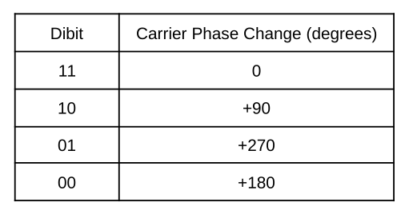

## Technical Details

### Reed Solomon Forward Error Correction

Reed-Solomon (RS) forward-error-correction is used to detect and correct errors in the header and payload blocks. The IL2P RS encoder processes header and payload data *after* it has been scrambled, to eliminate the error-amplifying characteristics of multiplicative LFSRs. RS codes have maximum block lengths defined by their underlying Galois Field (GF) size. IL2P uses an 8-bit field to match the size of a byte. The Galois Field is defined by reducing polynomial x8+x4+x3+x2+1. The maximum RS block size is 255 bytes, including parity. In order to support packets larger than the RS block size, large packets are segmented by the encoder into nearly-equal sized blocks before RS encoding into a contiguous IL2P packet.

Variable parity lengths of 2, 4, 6, 8, or 16 symbols (bytes) are used depending on the size of the payload block and selected FEC strength. This allows for increased efficiency for short packets, and provides a consistent symbol-error capability independent of packet length. Variable code shortening is used to eliminate block padding, enabled by a payload byte count subfield in the header.

The RS encoder uses zero as its first root.

Validity of received data is verified through successful decoding of RS blocks, as well as an optional trailing Cyclic Redundancy Check.

### Data Scrambling

IL2P employs packet-synchronous multiplicative scrambling to reduce transmit signal occupied bandwidth, ensure sufficient zero crossings for the receive data-clock PLL, and DC-balance the transmit bitstream. The scrambling is carried out by a linear-feedback-shift-register (LFSR), using feedback polynomial x9+x4+1, which is maximal. This polynomial is lower-order than that used in G3RUH 9600 modems. Selection of a lower order ensures the longest runs of continuous 1 or 0 bits will be shorter, which aids receive data-clock stability.

### Packet-Synchronized LFSR

The LFSR is reset to initial conditions at the start of every packet. Scrambling begins at the first bit after the Sync Word. The Preamble and Sync Word are not scrambled. During receive, prior to Sync Word detection, the LFSR is not engaged. The LFSR state is reset to initial conditions at the beginning of each code block within a packet.

### Scrambling Inside RS Code Block

IL2P LFSR encoding is applied inside the RS code block to eliminate the bit-error-amplifying characteristics of LFSR processing. A free-running LFSR (such as in the receive circuitry of the G3RUH modem) propagates bit errors at a multiple of the number of feedback polynomial coefficients (or taps on the LFSR). For example, when a single bit-error passes through a free-running LFSR defined by x9+x4+1 (or any other 3-term polynomial), 3 erroneous bits will appear on the output as they are XOR’d through the feedback taps of the shift register. This is of little concern in legacy AX.25 on-air protocols, because even a single bit error anywhere in the packet will cause the packet to be rejected.

RS codes correct errors on a symbol-by-symbol basis (byte-by-byte for IL2P). In order to prevent the LFSR spreading a single bit error from one RS symbol to another, the IL2P packet encoder applies RS encoding *after* the data has been scrambled, and the receiver applies RS decoding *before* the data is unscrambled. This allows bit errors to be corrected by the RS decoder before passing through the receive LFSR. The RS parity symbols themselves are not passed through an LFSR, they are appended to the RS block as computed.

### Extracting All Data from LFSR Memory

Efficient LFSR algorithms can be constructed by arranging an LFSR in Galois configuration. Galois configured LFSRs have bit delay, which means it takes some number of bit cycles after a bit of information enters the LFSR for it to appear in its scrambled form on the output. Because of this, the output of the LFSR is taken after its bit delay has elapsed (5 bits in this case), and flushed at the end of the data block to extract all information bits from its memory. The LFSR schematics given below represent Galois configuration of the IL2P scrambling polynomial.

### Transmit LFSR Schematic and Initial Conditions

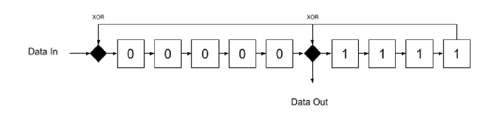

### Receive LFSR Schematic and Initial Conditions

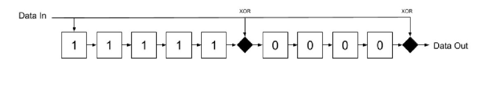

## Packet Structure

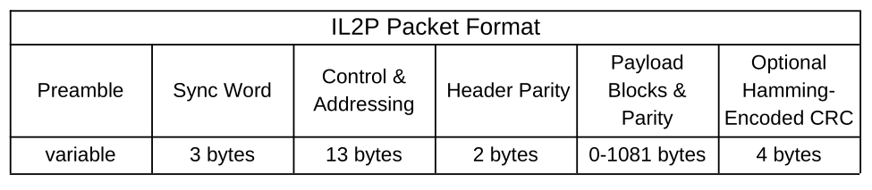

All bytes are sent **Most Significant Bit first**.

### Preamble and Packet Termination

The IL2P recommended Preamble is variable length, and consists of some number of carrier state changes (see Interface to Physical Layer). When packets are sent back-to-back, the Preamble of subsequent packets is omitted. There is no terminating symbol following packets. All IL2P packets are terminated by byte count, which is stored in the header.

### Sync Word

The IL2P Sync Word is 0xF15E48. This 24 bit sequence has an equal number of 1's and 0's and identifies the start of all IL2P Packets. Recommended Sync Word match tolerance at the receiver is 1 bit, meaning the receiver will declare a match if 23 out of the last 24 bits received match the Sync Word (any single bit flipped). This intended to ensure Sync Word detection on noisy links, at the cost of increasing the Sync Word match space up to 25 possible matches out of 224 possible bit sequences.

In a 9600 bit/sec application with open squelch and ignoring DCD, the expected average interval time between false matches is about 69 seconds (bit rate * 224 / 25). False matches are rejected by the receiver after the header fails RS decoding.

### FEC Level (Removed)

Reference to Baseline FEC is removed. This bit is now RESERVED in the header.

## IL2P Header Types

IL2P defines 2 possible header mappings, encoded in a 1-bit header subfield. A zero value indicates transparent encapsulation. A one value indicates translated encapsulation. Both mappings include a 10-bit payload count, enabling packet sizes up to 1023 payload bytes after the header. This count does not include parity bytes attached to the payload.

### IL2P Type 0 Header

Type 0 headers are used for transparent encapsulation of data - the entire encapsulated packet appears in the payload of the IL2P packet. Therefore, the header only includes the 10 bit PAYLOAD BYTE COUNT subfield as described in IL2P Type 1 Header. Type 0 encapsulation occurs when a KISS frame is presented to the IL2P encoder that cannot be translated. Some examples of non-translatable

KISS frames include MIC-E encoded APRS data (callsign characters can't translate to SIXBIT), Extended mode AX.25 frames (modulo-127 window sizes), and unrecognized AX.25 PID codes. These frames are placed entirely in the IL2P payload, so they still benefit from forward-error-correction.

### IL2P Type 1 Header

Type 1 headers contain a compressed and translated AX.25 header. The majority of common AX.25 traffic is compatible with Type 1 translation. The Control and Addressing section of the header contains everything normally found in an AX.25 header, with some modifications. IL2P stores destination and source callsigns using six bits per character in DEC SIXBIT coding (take the ASCII code for a printable character and subtract 0x20). IL2P also compresses the Protocol ID field to 4 bits rather than 8.

## Type 1 Header Control and Addressing Subfields

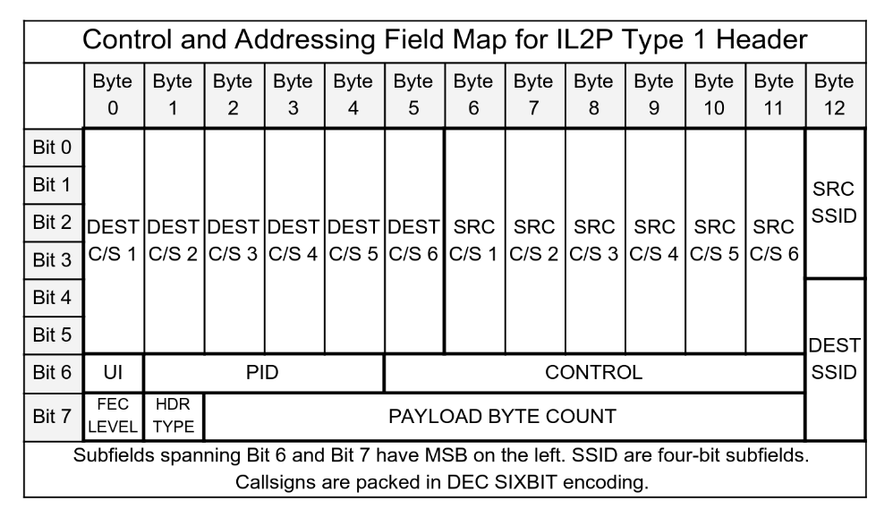

The Type 1 Header is composed of several fields found in the AX.25 header, though they are translated and compressed into an IL2P format. Type 1 Headers do not support AX.25 repeater callsign addressing, Modulo-127 extended mode window sequence numbers, nor any callsign characters that cannot translate to DEC SIXBIT. If these cases are encountered during IL2P packet encoding, the encoder switches to Type 0 Transparent Encapsulation.

### Payload Byte Count Subfield

The Payload Byte Count is stored in the header as a 10-bit subfield (possible values 0-1023). The count represents the total number of data bytes stored in all payload blocks following the header. The count excludes the header, and all parity symbols appended to payload blocks. See the Payload Blocks section of this document for a description of how payload parity symbols are appended to payload blocks.

### UI Subfield

AX.25 specifies 3 types of frames: Information, Supervisory, and Unnumbered. Each has different uses for the AX.25 Control field, and only some have a PID field. All AX.25 Information frames have a PID field. AX.25 Supervisory frames do not have a PID field. AX.25 Unnumbered frames do not have a PID field, unless their Control field is set to the Unnumbered Information (UI) opcode. The IL2P Type 1 Header UI subfield is 1 bit and is set only for AX.25 Unnumbered Information frames to signal that the PID field exists for a U-Frame.

### PID Subfield

In Type 1 header mapping, IL2P maps the AX.25 8-bit PID field into a 4-bit IL2P subfield. The IL2P PID subfield is also used to identify the AX.25 frame type, which informs the encoding and decoding of the IL2P Control subfield.

### Control Subfield

The Control Subfield contains 7 bits, and its mapping depends on the translated AX.25 frame type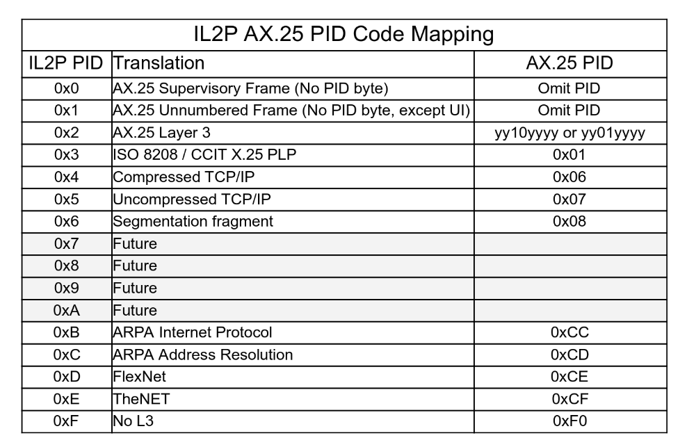

### Translated AX.25 I-Frame Control Subfield

All AX.25 I-Frames are considered commands. Therefore, IL2P omits the Command (C) bit for translated I-Frames. This subfield contains a Poll/Final (P/F) bit, receive sequence N(R), transmit sequence N(S). Translated AX.25 S -Frame Control Subfield AX.25 S-Frames can be one of 4 opcodes. All include a receive sequence number N(R), and a C bit.

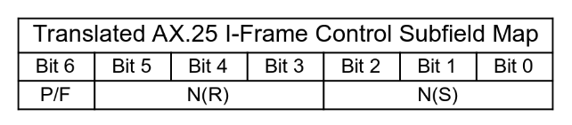

### Translated AX.25 S -Frame Control Subfield

AX.25 S-Frames can be one of 4 opcodes. All include a receive sequence number N(R), and a C bit.

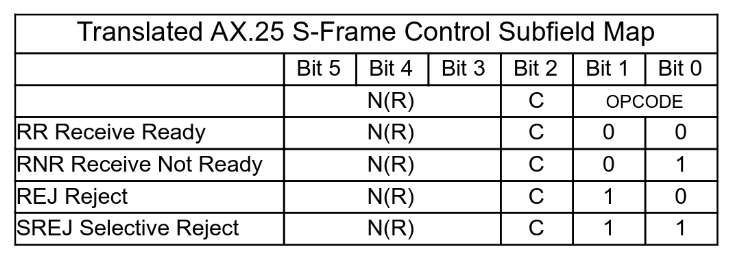

### Translated AX.25 U-Frame Control Subfield

AX.25 U-Frames contain an opcode, P/F bit, and C bit. Certain opcodes are always commands or responses, some can be either. There are no sequence numbers in U-Frames.

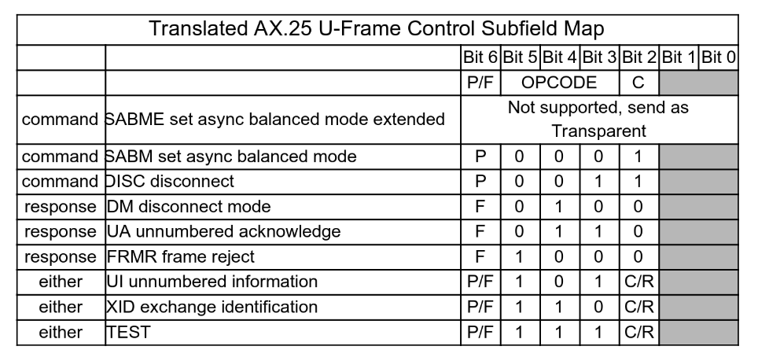

### Payload Blocks

Each payload block forms a contiguous RS code block once parity is added. RS codes can correct a number of erroneous symbols in a code block equal to half the number of parity symbols.

### Payload Block Size Computations

The encoder will always append 16 parity symbols per payload block, regardless of block size. This provides a minimum of roughly 3% symbol-error-rate recovery in the payload blocks. Shorter packets benefit from higher error recovery capacity.

payload_block_count = Ceiling(payload_byte_count / 239)

small_block_size = Floor(payload_byte_count / payload_block_count)

large_block_size = small_block_size + 1 large_block_count = payload_byte_count - (payload_block_count \* small_block_size)

small_block_count = payload_block_count - large_block_count

parity_symbols_per_block = 16

## IL2P Transmit Encoding Procedure for AX.25 KISS Data

1. Place Sync Word in the first three bytes of output buffer
2. Extract all AX.25 header fields
3. Check AX.25 header fields for compatibility with Type 01 Header

### If AX.25 Fields Type 1 Compatible

4. Compose IL2P Control & Addressing Field and place in output buffer
5. Initialize LFSR to initial conditions
6. Scramble the output buffer starting at the Control & Addressing Field
7. RS Encode output buffer starting at the Control & Addressing Field
8. Count payload bytes in AX.25 input data and perform Payload Block Size computations
9. Perform Parity Symbol Count computation
10. Scramble then RS encode each payload block (large blocks closest to header)
11. Send output buffer data to transmitter

### If AX.25 Fields Not Type 1 Compatible Send As Type 0

4. Count all bytes in AX.25 input data and perform Payload Block Size computations
5. Perform Parity Symbol Count computation
6. Place PAYLOAD BYTE COUNT subfield in Control & Addressing Field (all other fields 0)
7. Scramble the output buffer starting at the Control & Addressing Field
8. RS Encode output buffer starting at the Control & Addressing Field
9. Scramble then RS encode each payload block (large blocks closest to header)
10. Send output buffer data to transmitter

## IL2P Receive Decoding Procedure for KISS AX.25 Data

1. Search receive bitstream for Sync Word match

### On Sync Word Match Within 1 Bit Tolerance

2. Collect next 15 bytes as IL2P Header
3. RS Decode IL2P Header

### If RS Decode Successful

4. Initialize LFSR to initial conditions
5. Unscramble 13 byte Control & Addressing Field
6. Extract IL2P Control & Addressing Field and translate to AX.25 header in KISS buffer
7. Perform Payload Block Size computations on PAYLOAD BYTE COUNT
8. Perform Parity Symbol Count computation
9. Collect payload blocks from receive bitstream according to results of Step 7 and 8
10. RS decode and then unscramble each payload block
11. Place unscrambled data in KISS buffer and send to host
12. Return to Step 1

### If RS Decode of Header or Any Payload Block Unsuccessful

13. Discard packet
14. Return to Step 1

## Comparative Protocol Efficiency Analysis

Protocol Efficiency in the graph below shows the percentage of payload bytes that make up the packet, excluding Preamble. The IL2P Header and Sync Word consume 18 bytes, so efficiency generally increases as packet size grows. The sawtooth bumps in the graph represent Payload Byte Counts where an additional code block is required to contain the payload.

For comparison, the efficiency of AX.25 and FX.25 (255,239) protocols are included on the graph. The FX.25 line is computed using the smallest block size compatible with the payload size. The costs of bit-stuffing incurred under AX.25 and FX.25 are ignored.

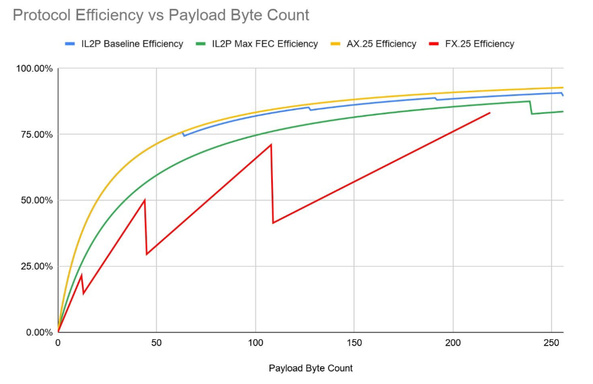

## Optional Trailing CRC with Hamming Encoding

Practical on-air experience in extremely noisy conditions has led to some observations of Reed-Solomon decoding failures that are not identified as failures by the decoder. Typically, these failures seem to occur when the number of erroneous symbols (bytes) in the packet is at or beyond the error correcting capability of the underlying Reed-Solomon code. Techniques can be used to limit the relative effort a Reed-Solomon decoder applies to reconstructing a codeword, but these techniques also limit the effectiveness of the underlying error-correcting code. While these decoding failures are rare, it is possible that erroneous data is passed to the host system.

To counter this, an optional trailing Cyclic Redundancy Check (CRC) protected by Hamming forward-error-correction is described. When the Reed-Solomon decoder knows the CRC is present, it can use maximum effort to reconstruct the packet and provide greater “coding gain”, which offsets the bandwidth cost of including several bytes of CRC. Since this CRC is optional, its use must be coordinated between participating stations.

CRC-16-CCITT is specified, which is the same polynomial used in AX.25. The CRC is calculated in the same manner as for an AX.25 frame, using the entire AX.25 data frame before IL2P header conversion, parity or scrambling. At the receiver, the CRC is used as a final validity test, to check that the reconstructed AX.25 frame is valid after IL2P decoding.

The CRC is placed after the IL2P frame, and is not part of the payload data nor the payload count.

Since it is outside the FEC-protected part of the frame, it is separately protected with a (7,4) Hamming code. The CRC is broken into four 4-bit nibbles, which are then each padded with 3 Hamming bits and a 0 bit in the MSB to create a single byte. The 16-bit CRC is encoded as four bytes.

### Hamming Encode Table

There are several ways to arrange a Hamming code. Each parity bit is computed by performing modulo-2 addition on certain bits in the data. IL2P CRC uses the following arrangement:

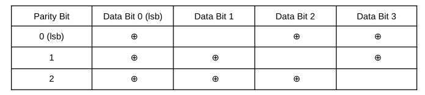

The IL2P CRC Hamming code is transparent, meaning the encoded 4 bits of data can be read in the least significant 4 bits of each codeword. The most significant bits are the Hamming parity bits. Using the described bit arrangement, the encode table is as follows:

[ 0x0 0x71 0x62 0x13 0x54 0x25 0x36 0x47 0x38 0x49 0x5a 0x2b 0x6c 0x1d 0x0e 0x7f ]

Index the encode table with the 4-bit value to be encoded. The 7-bit encoded value is found at that index. For example, 4-bit value **0x7** encodes as 7-bit value **0x47**.

### Hamming Decode Table

A corrupted Hamming codeword can be decoded by finding the uncorrupted codeword that requires the least number of bit flips to create the corrupted code (minimum bit distance). Since this code is relatively short, it is reasonable to create a table that contains all 128 minimum-bit-distance codeword pairs. The decode table is as follows:

[ 0x0 0x0 0x0 0x3 0x0 0x5 0xe 0x7 0x0 0x9 0xe 0xb 0xe 0xd 0xe 0xe 0x0 0x3 0x3 0x3 0x4 0xd 0x6 0x3 0x8 0xd 0xa 0x3 0xd 0xd 0xe 0xd 0x0 0x5 0x2 0xb 0x5 0x5 0x6 0x5 0x8 0xb 0xb 0xb 0xc 0x5 0xe 0xb 0x8 0x1 0x6 0x3 0x6 0x5 0x6 0x6 0x8 0x8 0x8 0xb 0x8 0xd 0x6 0xf 0x0 0x9 0x2 0x7 0x4 0x7 0x7 0x7 0x9 0x9 0xa 0x9 0xc 0x9 0xe 0x7 0x4 0x1 0xa 0x3 0x4 0x4 0x4 0x7 0xa 0x9 0xa 0xa 0x4 0xd 0xa 0xf 0x2 0x1 0x2 0x2 0xc 0x5 0x2 0x7 0xc 0x9 0x2 0xb 0xc 0xc 0xc 0xf 0x1 0x1 0x2 0x1 0x4 0x1 0x6 0xf 0x8 0x1 0xa 0xf 0xc 0xf 0xf 0xf ]

Index the decode table with the 7-bit codeword to be decoded. The 4-bit most-likely input data is found at that index. For example, 7-bit value **0x6** decodes as 4-bit value **0xe**.

### Encoded CRC Format

The 16-bit CRC is Hamming encoded in 4-bit nibbles, resulting in four 7-bit codewords. A zero is padded in the high 8th bit of each codeword. The resulting 32-bit encoded CRC is arranged as follows:

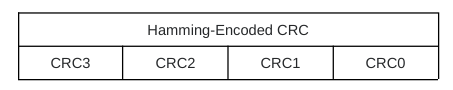

CRC3 is encoded from the high nibble of 16-bit CRC value and transmitted first, immediately following the IL2P frame.

## Weak Signal Extensions (removed)

This section is removed. On-air experimentation demonstrated little advantage in the methods previously described here. For weak-signal operation, IL2P has proven robust when used in conjunction with Binary Phase Shift Keying.

## Example Encoded Packets

These examples are intended for use as verification samples to help individuals implement their own IL2P encoders and decoders. Note that all AX.25 data samples below lack opening and closing flags,

and are not bit-stuffed. All IL2P data samples below include Trailing CRC and lack Sync Word.

### AX.25 S-Frame

This frame sample only includes a 15 byte header, without PID field. Destination Callsign: KA2DEW-2 Source Callsign: KK4HEJ-7 N(R): 5 P/F: 1 C: 1 Control Opcode: 00 (Receive Ready)

AX.25 data: 96 82 64 88 8A AE E4 96 96 68 90 8A 94 6F 81

IL2P Data: 26 57 4D 57 F1 D2 A8 F0 6A F2 7B AD 23 BD C0 7F 00 1D 2B

### AX.25 U-Frame

This is an AX.25 Unnumbered Information frame, such as APRS. Destination Callsign: CQ-0 Source Callsign: KK4HEJ-15 P/F: 0 C: 0 Control Opcode: 3 Unnumbered Information PID: 0xF0 No L3

AX.25 Data: 86 A2 40 40 40 40 60 96 96 68 90 8A 94 FF 03 F0

IL2P Data: 6A EA 9C C2 01 11 FC 14 1F DA 6E F2 53 91 BD 47 6C 54 54

### AX.25 I-Frame

This is an AX.25 I-Frame with 9 bytes of information after the 16 byte header.

Destination Callsign: KA2DEW-2 Source Callsign: KK4HEJ-2 P/F: 1 C: 1 N(R): 5 N(S) 4 AX.25 PID: 0xCF TheNET IL2P Payload Byte Count: 9

AX.25 Data: 96 82 64 88 8A AE E4 96 96 68 90 8A 94 65 B8 CF 30 31 32 33 34 35 36 37 38

IL2P Data: 26 13 6D 02 8C FE FB E8 AA 94 2D 6A 34 43 35 3C 69 9F 0C 75 5A 38 A1 7F A5 DA D8 F6 EA 57 37 3D B1 2A B0 DE 44 A8 20 D0 1D 5A 2B 38

## References for Further Study

Phil Karn KA9Q's "Convolutional Decoders for Amateur Packet Radio" on his website: <https://www.ka9q.net/papers/cnc_coding.html>

Consultative Committee for Space Data Systems (CCSDS) Telemetry Channel Coding: <https://public.ccsds.org/Pubs/101x0b4s.pdf>

General background on Polynomial Codes, Error Detection, and Error Correction: Widjaja, Indra and Leon-Garcia, Alberto. *Communication Networks*. New York: McGraw-Hill 2004 166-190. Print.

A good primer on Reed Solomon codes from the BBC: <https://downloads.bbc.co.uk/rd/pubs/whp/whp-pdf-files/WHP031.pdf>

James Miller's G3RUH 9600 Modem: <https://www.amsat.org/amsat/articles/g3ruh/109.html>

Another 9600 modem implementation by John Magliacane KD2BD: <https://www.amsat.org/amsat/articles/kd2bd/9k6modem/9k6modem.html>

The AX.25 2.2 specification: [http://www.ax25.net/AX25.2.2-Jul 98-2.pdf](http://www.ax25.net/AX25.2.2-Jul%2098-2.pdf)

The FX.25 draft specification: <http://www.stensat.org/docs/FX-25_01_06.pdf>

Wikipedia DEC SIXBIT encoding: [https://en.wikipedia.org/wiki/Six-bit_character_code\#DEC_six-bit_code](https://en.wikipedia.org/wiki/Six-bit_character_code#DEC_six-bit_code)

Wikipedia Linear Feedback Shift Registers: <https://en.wikipedia.org/wiki/Linear-feedback_shift_register>

KISS Protocol: <https://www.ax25.net/kiss.aspx>

ITU V.26 Recommendation (early QPSK modem specification): <https://www.itu.int/rec/T-REC-V.26-198811-I/en>

## Acknowledgements

Tadd Torborg (KA2DEW) helped test overall effectiveness of IL2P over VHF and UHF FM links through implementation on the NCPACKET TARPN Network. <https://tarpn.net/t/packet_radio_networking.html>

Tom Fanning (M0LTE) also helped test the effectiveness of IL2P, notably over HF links in the United Kingdom. His feedback, along with the feedback of others in the OARC motivated the development of the Trailing CRC scheme. <https://www.oarc.uk/>

Jon Naylor (G4KLX) helped design and test the Trailing CRC/Hamming Encoding scheme. Jon also provided the example encoded packets included in this document.

John Wiseman (G8BPQ) helped specify and test the BPSK and QPSK symbol maps.

## Changes

26 Jan 2020 v0.3: Updated dead link to AX.25 specification.

1 Aug 2020 v0.4: Added Max FEC scheme (16 parity bytes per block), updated protocol efficiency graph.

7 Jun 2022 v0.5: Added Weak Signal Extensions.

12 Feb 2024 v0.6: Added Trailing CRC description. Removed Weak Signal Extensions. Corrected description of block scrambling. Removed reference to Baseline FEC level. Added BPSK and QPSK symbol maps. Updated example encoded packets. Minor edits for readability.

This document is maintained by Nino Carrillo (KK4HEJ), reachable at: [nino.carrillo@outlook.com](mailto:nino.carrillo@outlook.com).
